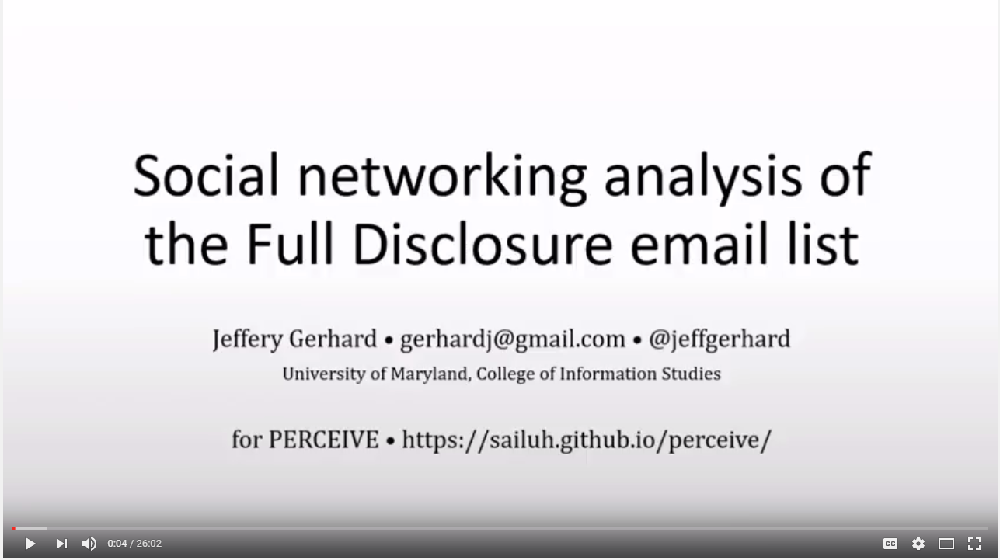

# PERCEIVE-related personal repository
## Jeff Gerhard, April 27, 2017
### gerhardj@gmail.com &middot; @jeffgerhard

This repository contains code, data, and source images for PERCEIVE used as part of an independent study project, spring 2017. 

Including [draft version of Jupyter notebook](full_disclosure_introduction.ipynb) as final report.

The accompanying presentation is available on youtube:

